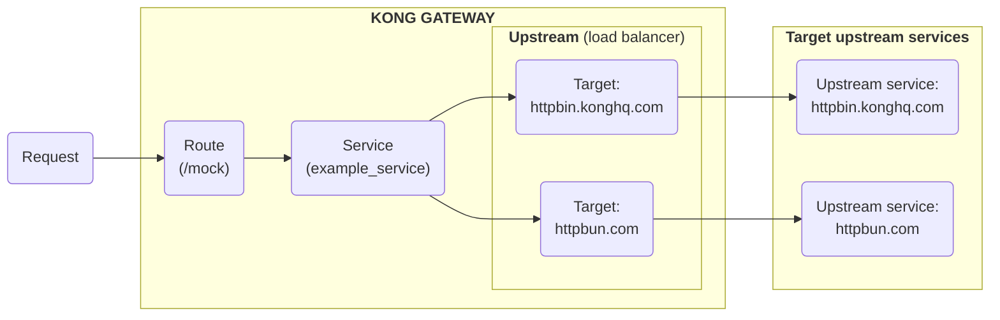

# [Targets](https://developer.konghq.com/gateway/entities/target/)

## What is a Target?

Target은 포트가 있는 IP 주소 또는 호스트 이름을 사용하여 Upstream 서비스의 인스턴스를 식별합니다. 각 Upstream에는 여러 개의 Target이 있을 수 있습니다. Target은 Upstream에서 로드 밸런싱을 위해 사용됩니다. 예를 들어, `example_upstream` Upstream이 있는 경우 `httpbin.konghq.com` 과 `httpbun.com` 이라는 두 가지 Target을 가리킬 수 있습니다. 이는 서버 중 하나(예: `httpbin.konghq.com`)를 사용할 수 없는 경우 자동으로 문제를 감지하고 모든 트래픽을 작업 중인 서버(`httpbun.com`)로 라우팅하기 위함입니다.

다음 다이어그램은 Upstream에서 Target이 로드 밸런싱에 어떻게 사용되는지를 보여줍니다:



## Target Schema

Target 엔티티의 전체 스키마는 다음과 같습니다:

| 필드명       | 타입   | 필수 여부 | 기본값 | 설명                              |
| ------------ | ------ | --------- | ------ | --------------------------------- |
| `id`         | string | 아니오    | -      | Target의 고유 ID (자동 생성)      |
| `target`     | string | 예        | -      | 백엔드 서버 주소 (host:port 형식) |
| `weight`     | number | 아니오    | `100`  | 로드 밸런싱 가중치 (0-1000)       |
| `tags`       | array  | 아니오    | -      | Target 태그                       |
| `upstream`   | object | 아니오    | -      | 연결된 Upstream 정보              |
| `created_at` | number | 아니오    | -      | Target 생성 시간 (Unix timestamp) |

### Target 상태

Target은 다음 상태 중 하나를 가집니다:

| 상태          | 설명                                  |
| ------------- | ------------------------------------- |
| `healthy`     | Target이 정상 작동 중                 |
| `unhealthy`   | Target이 비정상 상태 (헬스 체크 실패) |
| `dns_error`   | DNS 해석 실패                         |
| `dns_updated` | DNS 업데이트됨                        |

## Target 가중치 (Weight)

Target의 가중치는 로드 밸런싱에서 중요한 역할을 합니다:

- **가중치 0**: Target이 비활성화됨 (트래픽을 받지 않음)
- **가중치 1-1000**: 상대적 트래픽 비율을 나타냄
- **기본값 100**: 다른 Target과 동일한 비율로 트래픽 처리

### 가중치 예시

```yaml
# 3개의 Target이 있는 경우
targets:
  - target: server1.example.com:80
    weight: 100 # 33.3% 트래픽
  - target: server2.example.com:80
    weight: 200 # 66.7% 트래픽
  - target: server3.example.com:80
    weight: 0 # 0% 트래픽 (비활성화)
```

## Using Hostname

Target은 IP 주소 대신 호스트 이름을 가질 수도 있습니다. 이 경우 이름이 해결되고 발견된 모든 항목이 로드 밸런서에 개별적으로 추가됩니다.

예를 들어, `weight = 100`을 가진 `api.host.com:123`을 추가했다고 하면

- 호스트 이름 `api.host.com` 이 IP 주소가 2개인 A 레코드로 해결되면, 두 IP 주소가 각각 `weight = 100`과 포트 123인 타겟으로 추가됩니다.
- 호스트 이름이 SRV 레코드로 해결되면 DNS 레코드의 `port` 및 `weight` 필드가 사용되며 Target에 설정된 포트 및 가중치를 재정의합니다.

밸런서는 DNS 레코드의 `ttl` 설정을 준수합니다. 만료되면 네임서버에 쿼리하고 밸런서를 업데이트합니다. DNS 레코드에 `ttl=0`이 있으면 호스트 이름이 지정된 가중치를 가진 단일 대상으로 추가됩니다. 네임서버는 모든 요청에 대해 쿼리되며, 요청에 지연 시간을 추가합니다.

## Configuration Examples

### 기본 Target 설정

```json
{
  "target": "192.168.1.10:8080",
  "weight": 100
}
```

### 호스트명을 사용한 Target 설정

```json
{
  "target": "api.example.com:443",
  "weight": 200
}
```

### 여러 Target이 포함된 Upstream 설정

```yaml
_format_version: "3.0"
upstreams:
  - name: my-upstream
    targets:
      - target: server1.example.com:80
        weight: 100
      - target: server2.example.com:80
        weight: 200
      - target: server3.example.com:80
        weight: 0 # 비활성화
```

### API를 통한 Target 관리

```bash
# Target 추가
curl -X POST http://localhost:8001/upstreams/my-upstream/targets \
  --header "Content-Type: application/json" \
  --data '{
    "target": "192.168.1.10:8080",
    "weight": 100
  }'

# Target 목록 조회
curl http://localhost:8001/upstreams/my-upstream/targets

# 특정 Target 조회
curl http://localhost:8001/upstreams/my-upstream/targets/{target-id}

# Target 가중치 업데이트
curl -X PATCH http://localhost:8001/upstreams/my-upstream/targets/{target-id} \
  --header "Content-Type: application/json" \
  --data '{
    "weight": 200
  }'

# Target 삭제
curl -X DELETE http://localhost:8001/upstreams/my-upstream/targets/{target-id}
```

### decK을 사용한 Target 설정

```yaml
_format_version: "3.0"
upstreams:
  - name: production-upstream
    targets:
      - target: prod-server1.example.com:80
        weight: 100
      - target: prod-server2.example.com:80
        weight: 100
      - target: prod-server3.example.com:80
        weight: 50
  - name: staging-upstream
    targets:
      - target: staging-server.example.com:80
        weight: 100
```

## Target 관리 전략

### Blue-Green 배포

```yaml
# Blue 환경 (현재 운영)
upstreams:
  - name: api-upstream
    targets:
      - target: blue-server.example.com:80
        weight: 100
      - target: green-server.example.com:80
        weight: 0 # 대기 상태
```

```yaml
# Green 환경으로 전환
upstreams:
  - name: api-upstream
    targets:
      - target: blue-server.example.com:80
        weight: 0 # 비활성화
      - target: green-server.example.com:80
        weight: 100 # 활성화
```

### Canary 배포

```yaml
# 소량 트래픽을 새 버전으로 라우팅
upstreams:
  - name: api-upstream
    targets:
      - target: stable-server.example.com:80
        weight: 90 # 90% 트래픽
      - target: canary-server.example.com:80
        weight: 10 # 10% 트래픽
```

### 점진적 트래픽 증가

```yaml
# 1단계: 5% 트래픽
upstreams:
  - name: api-upstream
    targets:
      - target: old-server.example.com:80
        weight: 95
      - target: new-server.example.com:80
        weight: 5

# 2단계: 25% 트래픽
upstreams:
  - name: api-upstream
    targets:
      - target: old-server.example.com:80
        weight: 75
      - target: new-server.example.com:80
        weight: 25

# 3단계: 100% 트래픽
upstreams:
  - name: api-upstream
    targets:
      - target: old-server.example.com:80
        weight: 0
      - target: new-server.example.com:80
        weight: 100
```

## Best Practices

### Target 설계 원칙

1. **명확한 네이밍**: Target의 호스트명을 명확하고 의미있게 설정합니다.

   - `api-prod-01.example.com`
   - `api-staging-01.example.com`
   - `api-dev-01.example.com`

2. **가중치 관리**: 비즈니스 요구사항에 따라 적절한 가중치를 설정합니다.

   - 동일한 성능의 서버: 동일한 가중치
   - 성능이 다른 서버: 성능에 비례한 가중치

3. **헬스 체크**: Upstream의 헬스 체크를 활성화하여 자동으로 비정상 Target을 제외합니다.

### Target 관리 팁

1. **점진적 배포**: 새 Target을 추가할 때는 가중치를 점진적으로 증가시킵니다.

2. **모니터링**: Target의 상태와 성능을 지속적으로 모니터링합니다.

3. **백업 계획**: 주요 Target이 실패할 경우를 대비한 백업 Target을 준비합니다.

### 성능 최적화

1. **DNS 캐싱**: 호스트명을 사용하는 경우 적절한 TTL을 설정합니다.

2. **연결 풀링**: Upstream의 연결 풀 설정을 최적화합니다.

3. **지리적 분산**: 가능한 경우 지리적으로 가까운 Target을 사용합니다.

## Troubleshooting

### 일반적인 문제들

| 문제                            | 원인                         | 해결 방법                          |
| ------------------------------- | ---------------------------- | ---------------------------------- |
| Target에 연결할 수 없음         | 잘못된 호스트명/IP 또는 포트 | Target 주소와 포트 확인            |
| DNS 해석 실패                   | 잘못된 호스트명              | DNS 설정 확인                      |
| 가중치가 적용되지 않음          | 가중치 설정 오류             | 가중치 값 확인 (0-1000)            |
| Target이 로드 밸런싱에서 제외됨 | 헬스 체크 실패               | Target 상태 및 헬스 체크 설정 확인 |
| 트래픽이 한쪽으로만 흐름        | 가중치 불균형                | 가중치 분배 확인                   |

### 디버깅 방법

```bash
# Target 상태 확인
curl http://localhost:8001/upstreams/my-upstream/targets

# Upstream 상태 확인
curl http://localhost:8001/upstreams/my-upstream

# Kong 상태 확인
curl http://localhost:8001/status

# DNS 해석 테스트
nslookup api.example.com
dig api.example.com

# Target 연결 테스트
curl -v http://192.168.1.10:8080/health
```

### Target 모니터링

```bash
# Target별 요청 수 확인
curl http://localhost:8001/upstreams/my-upstream/targets | jq '.data[] | {target: .target, weight: .weight}'

# 헬스 체크 상태 확인
curl http://localhost:8001/upstreams/my-upstream/health

# 실시간 로그 모니터링
tail -f /var/log/kong/access.log | grep "upstream"
```
