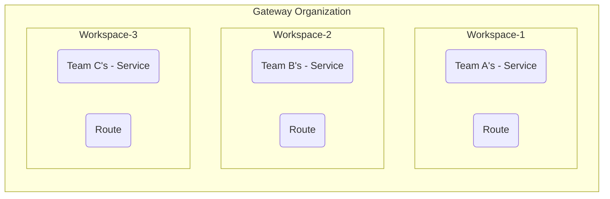

# [Workspaces](https://developer.konghq.com/gateway/entities/workspace/)

## What is a Workspace?

Workspace는 독립적으로 관리할 수 있도록 Kong Gateway 엔티티의 이름을 지정하는 방법입니다. Workspace는 [RBAC](https://developer.konghq.com/gateway/entities/rbac/)와 결합하여 팀이 서로 독립적으로 운영할 수 있는 독립된 환경을 만듭니다. Workspace는 서비스처럼 엔티티를 서로 공유할 수 없으며, Workspace에서 올바른 권한을 가진 Workspace 관리자만이 엔티티를 관리할 수 있습니다.

Workspace는 Kong Gateway 구성 객체를 격리하여 [multi-tenancy](https://developer.konghq.com/mesh/mesh-multi-tenancy/#configuring-your-mesh-and-multi-tenancy)를 지원합니다. RBAC와 페어링하면, Kong Gateway 관리자는 Control plane 내에서 효과적으로 tenants를 생성할 수 있습니다. Workspace 관리자는 Kong Manager, Admin API 및 선언적 구성 도구 decK에서 Kong Gateway 구성의 일부만 분리하고 안전하게 접근할 수 있습니다.

다음 다이어그램은 Workspace가 어떻게 팀별로 격리된 환경을 제공하는지 보여줍니다:



## Workspace Schema

Workspace 엔티티의 전체 스키마는 다음과 같습니다:

| 필드명       | 타입   | 필수 여부 | 기본값 | 설명                                 |
| ------------ | ------ | --------- | ------ | ------------------------------------ |
| `id`         | string | 아니오    | -      | Workspace의 고유 ID (자동 생성)      |
| `name`       | string | 예        | -      | Workspace의 고유한 이름              |
| `comment`    | string | 아니오    | -      | Workspace에 대한 설명                |
| `tags`       | array  | 아니오    | -      | Workspace 태그                       |
| `created_at` | number | 아니오    | -      | Workspace 생성 시간 (Unix timestamp) |
| `updated_at` | number | 아니오    | -      | Workspace 수정 시간 (Unix timestamp) |

### Workspace 특징

- **격리성**: 각 Workspace는 완전히 독립된 환경을 제공합니다
- **보안**: RBAC와 연동하여 접근 권한을 세밀하게 제어할 수 있습니다
- **멀티테넌시**: 여러 팀이나 조직이 동일한 Kong Gateway 인스턴스를 안전하게 공유할 수 있습니다
- **독립적 관리**: 각 Workspace는 독립적으로 관리되며 서로 영향을 주지 않습니다

## How does Kong Gateway resolve entity conflicts between Workspaces?

라우팅 규칙은 데이터 플레인 수준에서 구성됩니다. 데이터 플레인은 모든 작업 공간에 적용된 구성을 기반으로 클라이언트 트래픽을 라우팅합니다. 게이트웨이 서비스 및 경로와 같은 라우팅과 관련된 엔티티를 구성하면 데이터 플레인의 클라이언트 트래픽 라우팅 동작이 변경되지만, Kong gateway는 라우팅 규칙에 충돌이 없도록 항상 노력합니다.

트래픽을 적절한 Workspace으로 라우팅하기 위해, Kong Gateway는 충돌 감지 알고리즘을 사용합니다.

서비스 또는 경로가 생성되거나 수정될 때, Kong gateway 라우터는 작업이 다음 순서로 진행되도록 하기 전에 해당 객체의 존재를 확인합니다:

1. 생성된 서비스 또는 경로가 모든 작업 공간에서 고유한 경우 새 엔티티가 생성됩니다.
2. 현재 Workspace에 있는 기존 서비스 또는 경로 객체가 생성되거나 수정 중인 객체와 동일한 라우팅 규칙을 가지고 있으면 작업이 진행됩니다.
3. 동등한 서비스 또는 경로가 다른 작업 공간에서 발견되고 호스트가 제공되는 경우:
   1. 호스트 필드가 두 Workspace에서 일치하면 `409 Conflict` 오류가 반환됩니다.
   2. 호스트 필드가 일치하지 않으면 작업이 진행됩니다.
   3. 호스트가 절대값인 경우 `409 Conflict` 오류가 반환됩니다.

## Roles, groups, and permissions

Workspaces는 사용자가 독립적으로 Kong Gateway 엔티티를 제어할 수 있게 해주기 때문에, 사용자는 특정 Workspaces를 구성하기 위해 올바른 권한을 가져야 합니다. 사용자는 Workspaces를 구성하기 위해 슈퍼 관리자 또는 관리자 역할이 필요합니다.

다음 표는 각 관리자 역할이 가진 작업 공간 권한을 자세히 설명합니다:

|                                  | Super Admin | Admin |
| -------------------------------- | ----------- | ----- |
| 특정 Workspace로 엔티티 관리하기 | O           | O     |
| 새로운 Workspaces 만들기         | O           | X     |
| 관리자에게 역할 할당 및 취소     | O           | X     |
| 조직 전체의 모든 작업 공간 관리  | O           | X     |

자세한 정보는 [Role과 permission](https://developer.konghq.com/gateway/entities/rbac/)에서 확인하세요.

## Manage Workspaces with decK

decK를 사용하여 Workspace와 인터페이스할 때는 다음 decK 플래그를 사용해야 합니다.

### Manage multiple Workspaces

모든 작업 공간을 한 번에 관리하려면 `--all-workspaces` 플래그와 decK를 사용합니다:

```
deck gateway dump --all-workspaces
```

이렇게 하면 `default`를 포함한 특정 작업 공간 이름을 가진 개별 YAML 파일에 구성이 덤프됩니다.
다음과 같은 decK 파일 내에서 Workspaces을 특별히 설정할 수 있습니다.

```
_format_version: "3.0"
_workspace: default
services:
- name: example_service
```

### Deploy Workspace-specific config

decK 구성은 workspace 단위로 개별적으로 배포해야 합니다. 이는 `--workspace` 플래그를 사용하여 달성됩니다:

```
deck gateway sync default.yaml --workspace default
```

### Delete a Workspace configuration

decK can’t delete Workspaces. However, using `deck gateway reset` in combination with the `--workspace` or `--all-workspaces` flags forces decK to delete the entire configuration inside the Workspace, but not the Workspace itself.

decK는 Workspace를 삭제할 수 없습니다. 그러나 `--workspace` 또는 `--all-workspace` 플래그와 함께 `deck gateway reset`을 사용하면 decK는 Workspace 내부의 전체 구성을 삭제하지만 Workspace 자체는 삭제할 수 없습니다.

## Configuration Examples

### 기본 Workspace 설정

```json
{
  "name": "my-workspace",
  "comment": "개발팀을 위한 Workspace"
}
```

### API를 통한 Workspace 관리

```bash
# Workspace 생성
curl -X POST http://localhost:8001/workspaces \
  --header "Content-Type: application/json" \
  --data '{
    "name": "development",
    "comment": "개발 환경을 위한 Workspace"
  }'

# Workspace 목록 조회
curl http://localhost:8001/workspaces

# 특정 Workspace 조회
curl http://localhost:8001/workspaces/development

# Workspace 업데이트
curl -X PATCH http://localhost:8001/workspaces/development \
  --header "Content-Type: application/json" \
  --data '{
    "comment": "개발 및 테스트 환경을 위한 Workspace"
  }'

# Workspace 삭제
curl -X DELETE http://localhost:8001/workspaces/development
```

### decK을 사용한 Workspace 설정

```yaml
# development.yaml
_format_version: "3.0"
_workspace: development
services:
  - name: dev-api
    url: http://dev-api.example.com
    routes:
      - name: dev-route
        paths:
          - /dev
plugins:
  - name: rate-limiting
    config:
      minute: 100
```

```yaml
# production.yaml
_format_version: "3.0"
_workspace: production
services:
  - name: prod-api
    url: http://prod-api.example.com
    routes:
      - name: prod-route
        paths:
          - /api
plugins:
  - name: rate-limiting
    config:
      minute: 1000
```

### 다중 Workspace 관리

```bash
# 모든 Workspace 덤프
deck gateway dump --all-workspaces

# 특정 Workspace 동기화
deck gateway sync development.yaml --workspace development

# 특정 Workspace 리셋
deck gateway reset --workspace development
```

## Workspace 사용 사례

### 팀별 환경 분리

```yaml
# frontend-team.yaml
_format_version: "3.0"
_workspace: frontend-team
services:
  - name: frontend-api
    url: http://frontend-api.example.com
    routes:
      - name: frontend-route
        paths:
          - /frontend
plugins:
  - name: cors
    config:
      origins: ["https://frontend.example.com"]
```

```yaml
# backend-team.yaml
_format_version: "3.0"
_workspace: backend-team
services:
  - name: backend-api
    url: http://backend-api.example.com
    routes:
      - name: backend-route
        paths:
          - /backend
plugins:
  - name: key-auth
```

### 환경별 분리

```yaml
# development.yaml
_format_version: "3.0"
_workspace: development
services:
  - name: dev-service
    url: http://dev-service.example.com
    routes:
      - name: dev-route
        paths:
          - /dev
plugins:
  - name: rate-limiting
    config:
      minute: 1000 # 개발 환경은 제한이 느슨함
```

```yaml
# staging.yaml
_format_version: "3.0"
_workspace: staging
services:
  - name: staging-service
    url: http://staging-service.example.com
    routes:
      - name: staging-route
        paths:
          - /staging
plugins:
  - name: rate-limiting
    config:
      minute: 500 # 스테이징 환경은 중간 제한
```

```yaml
# production.yaml
_format_version: "3.0"
_workspace: production
services:
  - name: prod-service
    url: http://prod-service.example.com
    routes:
      - name: prod-route
        paths:
          - /api
plugins:
  - name: rate-limiting
    config:
      minute: 100 # 프로덕션 환경은 엄격한 제한
```

## Best Practices

### Workspace 설계 원칙

1. **명확한 네이밍**: Workspace 이름을 명확하고 의미있게 설정합니다.

   - `frontend-team`
   - `backend-team`
   - `development`
   - `staging`
   - `production`

2. **환경별 분리**: 개발, 스테이징, 프로덕션 환경을 별도의 Workspace로 분리합니다.

3. **팀별 분리**: 각 팀이 독립적으로 작업할 수 있도록 Workspace를 분리합니다.

### Workspace 관리 팁

1. **권한 관리**: RBAC를 사용하여 각 Workspace에 대한 접근 권한을 세밀하게 제어합니다.

2. **모니터링**: 각 Workspace의 사용량과 성능을 독립적으로 모니터링합니다.

3. **백업**: Workspace별로 설정을 백업하고 버전 관리를 수행합니다.

### 성능 최적화

1. **리소스 분리**: 각 Workspace가 필요한 리소스만 사용하도록 제한합니다.

2. **캐싱**: Workspace별로 적절한 캐싱 전략을 수립합니다.

3. **로드 밸런싱**: Workspace 간의 트래픽을 효율적으로 분산시킵니다.

## Troubleshooting

### 일반적인 문제들

| 문제                     | 원인                      | 해결 방법                |
| ------------------------ | ------------------------- | ------------------------ |
| Workspace를 찾을 수 없음 | 잘못된 Workspace 이름     | Workspace 이름 확인      |
| 권한이 없음              | RBAC 권한 부족            | 사용자 권한 확인         |
| 엔티티 충돌              | 동일한 라우팅 규칙        | 라우팅 규칙 수정         |
| 설정이 적용되지 않음     | 잘못된 Workspace 지정     | Workspace 컨텍스트 확인  |
| decK 동기화 실패         | Workspace가 존재하지 않음 | Workspace 생성 후 재시도 |

### 디버깅 방법

```bash
# Workspace 목록 확인
curl http://localhost:8001/workspaces

# 특정 Workspace의 엔티티 확인
curl http://localhost:8001/workspaces/development/services
curl http://localhost:8001/workspaces/development/routes

# RBAC 권한 확인
curl http://localhost:8001/rbac/users
curl http://localhost:8001/rbac/roles

# Kong 상태 확인
curl http://localhost:8001/status
```

### Workspace 모니터링

```bash
# Workspace별 엔티티 수 확인
curl http://localhost:8001/workspaces | jq '.data[] | {name: .name, id: .id}'

# 특정 Workspace의 상세 정보
curl http://localhost:8001/workspaces/development | jq '.'

# Workspace별 플러그인 확인
curl http://localhost:8001/workspaces/development/plugins | jq '.data[] | .name'
```

## FAQs

### Workspace를 활성화해야 하나요?

아니요, Kong Gateway Enterprise는 `default` Workspace와 함께 제공됩니다. 추가 Workspace를 생성할 수 있지만, default Workspace는 항상 유지되며 삭제할 수 없습니다.

### Workspace에 존재할 수 없는 엔티티가 있나요?

다음 엔티티들은 Workspace 내에 존재할 수 없습니다:

- **CA Certificates**: 모든 Workspace에 적용됩니다. mTLS 핸드셰이크에서 클라이언트 인증서를 검증하는 데 사용됩니다.
- **RBAC 엔티티**: Users, Roles, Admins, Groups는 Workspace 외부에 존재합니다. 하지만 특정 Workspace의 엔티티에 접근하려면 Workspace별 역할을 할당해야 합니다.
- **다른 Workspace**: Workspace 내에 다른 Workspace를 생성할 수 없습니다.

### Konnect에서 Workspace를 사용할 수 있나요?

아니요. 대신 Konnect는 API 생태계 내에서 엔티티를 관리하기 위한 더 강력한 Control Planes와 Control Plane Groups를 제공합니다.

### Workspace가 다른 Workspace와 같은 이름을 가질 수 있나요?

두 Workspace는 같은 이름을 공유할 수 없습니다. 하지만 Workspace 이름은 대소문자를 구분합니다. 예를 들어, "Payments"와 "payments"는 같지 않으며 두 개의 다른 Workspace로 인정됩니다. 혼동을 방지하기 위해 대소문자에 관계없이 고유한 이름을 사용하는 것을 권장합니다.

### Workspace를 지정하지 않고 엔티티를 생성하면 어떻게 되나요?

대상 Workspace를 지정하지 않으면 엔티티가 `default` workspace에 생성됩니다.
