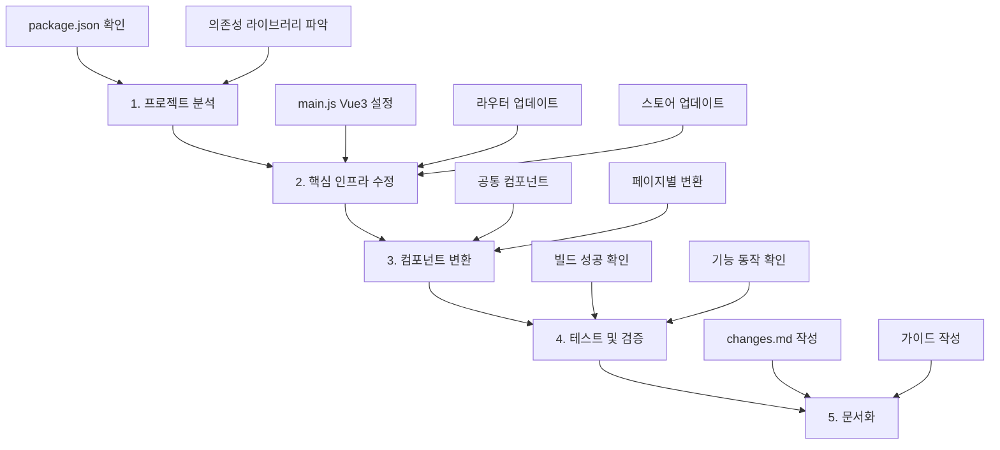
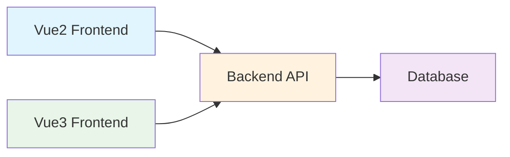
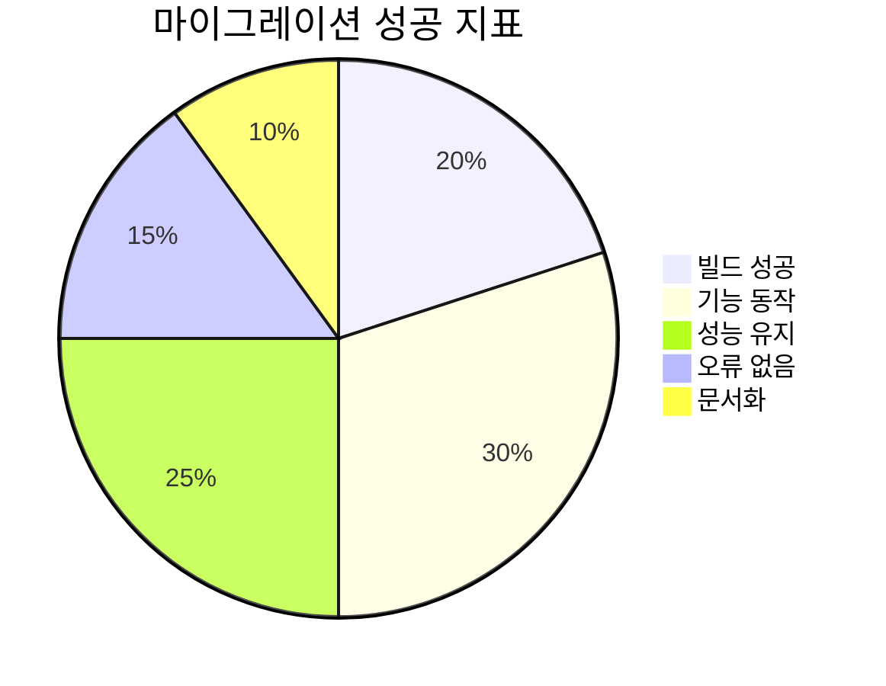

# Vue2 → Vue3 마이그레이션 대시보드

Vue3로의 전환을 위한 대화형 가이드입니다. 각 섹션을 탐색하며 빠르고 안정적인 마이그레이션을 준비하세요.

## 📋 개요

이 섹션은 마이그레이션의 핵심 목표를 정의합니다. 우리의 최우선 과제는 기존 소스 코드를 최소한으로 수정하여 빠르고 안정적으로 Vue3 환경으로 전환하고, 모든 기능이 정상적으로 동작하도록 보장하는 것입니다. 효율적인 전환을 위한 첫 걸음입니다.

## 🛠️ 작업 원칙

이 섹션에서는 마이그레이션 작업을 성공적으로 이끌기 위한 핵심 원칙들을 다룹니다. 작업 우선순위를 정하고, 코드 변환의 구체적인 기준을 세워 일관성 있고 효율적인 마이그레이션을 진행하는 방법을 안내합니다.

### 1. 마이그레이션 우선순위

성공적인 마이그레이션을 위해, 작업을 단계별로 나누어 체계적으로 접근합니다. 가장 중요한 빌드 오류 해결부터 시작하여 기능 확인, 최적화 순으로 진행합니다.

| 순서 | 단계                    | 설명                                                                                   | 중요도  | 예상 시간 |
| ---- | ----------------------- | -------------------------------------------------------------------------------------- | ------- | --------- |
| 1️⃣   | **빌드 오류 해결**      | `npm run dev` 시 발생하는 모든 에러를 해결하여 프로젝트가 실행 가능한 상태로 만듭니다. | 🔴 높음 | 1-2일     |
| 2️⃣   | **핵심 기능 동작 확인** | 로그인, 라우팅 등 필수 기능이 정상 동작하는지 검증합니다.                              | 🔴 높음 | 1일       |
| 3️⃣   | **성능 최적화**         | 차트, 대용량 데이터 처리 등 무거운 기능의 성능을 점검하고 개선합니다.                  | 🟡 중간 | 2-3일     |
| 4️⃣   | **UI/UX 개선**          | 디자인 및 레이아웃을 개선합니다. (마이그레이션 완료 후 권장)                           | 🟢 낮음 | 1-2주     |

### 2. 코드 변환 기준

Vue3와의 호환성을 위해 최소한의 코드를 수정하는 기준입니다. 기존 코드의 안정성을 유지하면서 최신 문법을 점진적으로 도입합니다.

#### Vue 문법 변환

| 구분          | 기존 (Vue2)      | 변경 후 (Vue3)       | 적용 시점        |
| ------------- | ---------------- | -------------------- | ---------------- |
| **API 방식**  | Options API 유지 | Options API 유지     | 기존 코드        |
| **신규 개발** | -                | Composition API 도입 | 신규/복잡한 로직 |

#### JavaScript 현대화

| 구분            | 기존 문법        | 현대화 문법   | 예시                                        |
| --------------- | ---------------- | ------------- | ------------------------------------------- |
| **변수 선언**   | `var`            | `const / let` | `var name = 'test'` → `const name = 'test'` |
| **비동기 처리** | `Promise.then()` | `async/await` | `fetch().then()` → `await fetch()`          |

### 3. 작업 순서

마이그레이션 작업의 효율적인 진행을 위한 순서입니다. 각 단계를 따라 체계적으로 진행하면 오류를 최소화할 수 있습니다.



| 단계                    | 작업 내용                                                                 | 주요 파일                      | 예상 시간 |
| ----------------------- | ------------------------------------------------------------------------- | ------------------------------ | --------- |
| **1️⃣ 프로젝트 분석**    | `package.json`을 확인하여 현재 Vue 버전과 의존성 라이브러리를 파악합니다. | `package.json`                 | 30분      |
| **2️⃣ 핵심 인프라 수정** | `main.js` 파일에서 Vue3 설정과 라우터, 스토어를 업데이트합니다.           | `main.js`, `router/`, `store/` | 2-3시간   |
| **3️⃣ 컴포넌트 변환**    | 공통 컴포넌트부터 시작하여 페이지별로 순차적으로 변환합니다.              | `components/`, `views/`        | 1-2일     |
| **4️⃣ 테스트 및 검증**   | 각 단계별로 빌드 성공 여부와 기능 동작을 확인합니다.                      | 전체 프로젝트                  | 2-4시간   |
| **5️⃣ 문서화**           | 모든 변경사항을 `changes.md`에 기록하고 가이드를 작성합니다.              | `changes.md`                   | 1-2시간   |

## 📝 파일 수정 패턴

마이그레이션 과정에서 반복적으로 나타나는 코드 수정 패턴을 소개합니다. 이 패턴들을 숙지하면 일반적인 오류들을 더 빠르고 일관되게 처리할 수 있습니다. 코드 비교를 통해 변경 사항을 명확하게 확인하세요.

### Import 경로 수정

#### 변경 전 (잘못된 경로)

```js
import UserComponent from "@/views/workflow/common/sr/user.vue";
```

#### 변경 후 (올바른 경로)

```js
import UserComponent from "@/views/core/common/user/user.vue";
```

### Vue3 ::v-deep 수정

자식 컴포넌트 스타일링을 위한 ::v-deep 문법이 Vue3에서는 :deep()으로 변경되었습니다.

#### 변경 전 (Vue2)

```scss
::v-deep .el-table {
  // 스타일
}
```

#### 변경 후 (Vue3)

```scss
:deep(.el-table) {
  // 스타일
}
```

## 📦 라이브러리별 마이그레이션 가이드

프로젝트에서 사용하는 외부 라이브러리들은 Vue3와의 호환성 확인이 필수적입니다. 이 섹션에서는 자주 사용되는 라이브러리들의 마이그레이션 방법을 안내하여 의존성 관련 문제를 해결하는 데 도움을 줍니다.

### 라이브러리 마이그레이션 매트릭스

| 라이브러리      | Vue2 버전          | Vue3 버전          | 주요 변경사항                 | 난이도  |
| --------------- | ------------------ | ------------------ | ----------------------------- | ------- |
| **쿠키 관리**   | `vue-cookie`       | `vue-cookie-next`  | `delete()` → `removeCookie()` | 🟢 쉬움 |
| **UI 컴포넌트** | `element-ui`       | `element-plus`     | Table 컴포넌트 문법 변경      | 🟡 중간 |
| **에디터**      | `@toast-ui/editor` | `@toast-ui/editor` | Composition API 적용 필요     | 🟡 중간 |

### 쿠키 관리: vue-cookie → vue-cookie-next

```bash
# 설치
npm uninstall vue-cookie
npm install vue-cookie-next
```

| 기능       | 기존 (vue-cookie)       | 변경 후 (vue-cookie-next)     |
| ---------- | ----------------------- | ----------------------------- |
| **설치**   | `Vue.use(VueCookie)`    | `app.use(VueCookieNext)`      |
| **삭제**   | `this.$cookie.delete()` | `this.$cookie.removeCookie()` |
| **사용법** | `this.$cookie.get()`    | `this.$cookie.get()` (동일)   |

### Element UI → Element Plus

Vue2용 **Element UI**는 Vue3에서 동작하지 않으므로 **Element Plus**로 업그레이드해야 합니다. 특히, **Table** 컴포넌트는 큰 변화가 있으니 [공식 문서](https://element-plus.org/en-US/component/table.html#table)를 참고하여 변화된 문법을 적용해야 합니다. 새로운 문법과 컴포넌트 사용법은 [Element Plus 공식 문서](https://element-plus.org/en-US/)를 반드시 참고하세요.

```bash
# 설치
npm uninstall element-ui
npm install element-plus
```

| 컴포넌트   | Element UI (Vue2) | Element Plus (Vue3) | 변경 사항               |
| ---------- | ----------------- | ------------------- | ----------------------- |
| **Table**  | `el-table-column` | `el-table-column`   | 데이터 바인딩 방식 변경 |
| **Form**   | `el-form-item`    | `el-form-item`      | 유효성 검사 문법 변경   |
| **Dialog** | `el-dialog`       | `el-dialog`         | v-model 사용법 변경     |

### 토스트 UI 에디터 (Toast UI Editor)

Vue 2에서 사용하던 토스트 UI 에디터는 Vue 3에서 사용하려면 새롭게 구성해야 합니다. 특히, **Composition API**와 `<script setup>` 문법을 사용해 컴포넌트를 개발하는 것이 권장됩니다. 아래는 Vue 3 환경에서 토스트 UI 에디터를 구성하는 예시입니다.

#### Toast UI component

Vue 3의 컴포지션 API를 사용해 스크립트를 작성하는 방식입니다.

```js
import { ref, onMounted } from "vue";
import Editor from "@toast-ui/editor";
import "@toast-ui/editor/dist/toastui-editor.css";

const props = defineProps({
  modelValue: {
    type: String,
    required: false,
    default: "",
  },
});
const emit = defineEmits(["update:modelValue"]);
const editor = ref();
onMounted(() => {
  const e = new Editor({
    el: editor.value,
    height: "400px",
    initialEditType: "wysiwyg",
    previewStyle: "vertical",
    events: {
      change: () => emit("update:modelValue", e.getMarkdown()),
    },
  });
});
```

#### template

에디터 컴포넌트를 렌더링하는 부분입니다.

```html
<template>
  <div>
    <div ref="editor" />
  </div>
</template>
```

## 📦 package.json 파일 분석

마이그레이션의 첫 단계인 **프로젝트 분석**은 **package.json** 파일에서 시작됩니다. 이 파일은 프로젝트의 의존성과 스크립트를 정의하며, 어떤 라이브러리를 업데이트해야 하는지 파악하는 데 필수적입니다.
다음의 내용은 예시입니다.

```json
{
  "name": "frontend",
  "version": "0.0.0",
  "private": true,
  "type": "module",
  "scripts": {
    "dev": "vite",
    "build": "vite build",
    "preview": "vite preview",
    "lint": "eslint . --ext .js,.jsx,.cjs,.mjs,.vue --fix"
  },
  "dependencies": {
    "@codemirror/lang-cpp": "^6.0.3",
    "@codemirror/lang-java": "^6.0.2",
    "@codemirror/lang-javascript": "^6.2.4",
    "@codemirror/lang-php": "^6.0.2",
    "@codemirror/lang-python": "^6.2.1",
    "@codemirror/language": "^6.11.2",
    "@codemirror/state": "^6.5.2",
    "@codemirror/theme-one-dark": "^6.1.3",
    "@mdi/js": "^7.4.47",
    "@toast-ui/editor": "^3.2.2",
    "axios": "^1.6.7",
    "chart.js": "^4.5.0",
    "codemirror": "^6.0.2",
    "element-plus": "^2.5.6",
    "mitt": "^3.0.1",
    "pinia": "^2.1.7",
    "vue": "^3.4.21",
    "vue-chartjs": "^5.3.2",
    "vue-codemirror": "^6.1.1",
    "vue-cookie-next": "^1.0.2",
    "vue-router": "^4.3.0",
    "vue-sweetalert2": "^5.0.11"
  },
  "devDependencies": {
    "@eslint/eslintrc": "^3.3.1",
    "@eslint/js": "^9.31.0",
    "@vitejs/plugin-vue": "^5.0.4",
    "@vue/eslint-config-prettier": "^10.2.0",
    "eslint": "^9.31.0",
    "eslint-config-prettier": "^10.1.8",
    "eslint-plugin-prettier": "^5.5.3",
    "eslint-plugin-vue": "^10.3.0",
    "prettier": "^3.6.2",
    "sass": "^1.71.1",
    "vite": "^5.1.4",
    "vite-plugin-eslint": "^1.8.1",
    "unplugin-auto-import": "^20.0.0",
    "unplugin-element-plus": "^0.10.0",
    "unplugin-vue-components": "^29.0.0"
  },
  "optionalDependencies": {
    "fsevents": "*"
  },
  "eslintConfig": {
    "root": true,
    "env": {
      "node": true,
      "browser": true,
      "es2022": true
    },
    "extends": [
      "plugin:vue/vue3-essential",
      "eslint:recommended",
      "@vue/eslint-config-prettier"
    ],
    "parserOptions": {
      "parser": "@babel/eslint-parser",
      "ecmaVersion": 2022,
      "sourceType": "module"
    },
    "rules": {
      "vue/multi-word-component-names": "off"
    }
  },
  "browserslist": ["> 1%", "last 2 versions"]
}
```

## ✅ 품질 관리 및 체크리스트

마이그레이션의 성공은 단순히 빌드가 성공하는 것을 넘어, 안정적인 기능 동작과 성능 유지를 의미합니다. 이 대화형 체크리스트를 사용하여 마이그레이션 작업의 완성도를 스스로 점검하고 관리하세요.

### 핵심 검증 항목

| 구분            | 체크 항목                                              | 상태 | 비고                   |
| --------------- | ------------------------------------------------------ | ---- | ---------------------- |
| **🔧 빌드**     | [ ] **빌드 오류**가 하나도 없어야 합니다.              | ⬜   | `npm run build` 성공   |
| **🌐 브라우저** | [ ] **브라우저 콘솔**에 에러 메시지가 없어야 합니다.   | ⬜   | 개발자 도구 확인       |
| **⚙️ 기능**     | [ ] 모든 **기본 기능**이 정상적으로 동작해야 합니다.   | ⬜   | 로그인, 라우팅 등      |
| **📊 성능**     | [ ] 마이그레이션 후 **성능**이 저하되지 않아야 합니다. | ⬜   | 로딩 속도 측정         |
| **📱 UI/UX**    | [ ] 주요 페이지 **로딩**이 정상적인지 확인했는가?      | ⬜   | 각 페이지 테스트       |
| **🔐 보안**     | [ ] **인증 시스템**이 올바르게 동작하는가?             | ⬜   | 로그인/로그아웃 테스트 |
| **📱 반응형**   | [ ] **반응형 레이아웃**이 깨지지 않았는지 확인했는가?  | ⬜   | 모바일/태블릿 테스트   |
| **📝 문서**     | [ ] 변경사항을 `changes.md`에 **문서화**했는가?        | ⬜   | 모든 변경사항 기록     |

### 상세 검증 체크리스트

#### 🔧 빌드 및 배포

- [ ] `npm run dev` 실행 성공
- [ ] `npm run build` 실행 성공
- [ ] 프로덕션 빌드 파일 정상 생성
- [ ] 배포 환경에서 정상 동작

#### 🌐 브라우저 호환성

- [ ] Chrome 최신 버전에서 정상 동작
- [ ] Firefox 최신 버전에서 정상 동작
- [ ] Safari 최신 버전에서 정상 동작
- [ ] Edge 최신 버전에서 정상 동작

#### ⚙️ 핵심 기능 테스트

- [ ] 사용자 로그인/로그아웃
- [ ] 페이지 라우팅
- [ ] 데이터 CRUD 작업
- [ ] 파일 업로드/다운로드
- [ ] 검색 기능
- [ ] 필터링 기능

#### 📊 성능 검증

- [ ] 초기 로딩 시간 측정
- [ ] 페이지 전환 속도 확인
- [ ] 메모리 사용량 모니터링
- [ ] 번들 크기 최적화 확인

## 💡 주의사항

마이그레이션 시 발생할 수 있는 잠재적 문제를 미리 파악하고 대비하는 것이 중요합니다. 백엔드 및 브라우저 호환성 문제를 확인하고, 성능 관련 고려사항을 숙지하여 예기치 않은 문제를 방지하세요.

### ⚠️ 주요 주의사항 매트릭스

| 구분                   | 주의사항                         | 영향도  | 대응 방안                |
| ---------------------- | -------------------------------- | ------- | ------------------------ |
| **🔧 백엔드 호환성**   | API 엔드포인트 변경 없음 확인    | 🔴 높음 | API 문서 검토, 테스트    |
| **🌐 브라우저 호환성** | IE 지원 중단, 최신 브라우저 필요 | 🔴 높음 | 브라우저 지원 정책 수립  |
| **📊 성능**            | 번들 크기 증가 가능성            | 🟡 중간 | 코드 스플리팅, 지연 로딩 |
| **🔐 보안**            | 의존성 라이브러리 보안 취약점    | 🟡 중간 | 보안 스캔, 업데이트      |

### 🔧 백엔드 호환성

마이그레이션은 프론트엔드 작업입니다. 백엔드 API와의 호환성 문제가 없는지 사전에 확인하세요.



#### 확인 사항

- [ ] API 엔드포인트 변경 없음
- [ ] 요청/응답 데이터 구조 동일
- [ ] 인증 토큰 방식 유지
- [ ] CORS 설정 확인

### 🌐 브라우저 호환성

Vue3는 **Internet Explorer(IE)를 지원하지 않습니다.** 최신 브라우저에서 테스트해야 합니다.

| 브라우저              | 지원 여부 | 최소 버전 | 테스트 필요 |
| --------------------- | --------- | --------- | ----------- |
| **Chrome**            | ✅ 지원   | 87+       | 필수        |
| **Firefox**           | ✅ 지원   | 78+       | 필수        |
| **Safari**            | ✅ 지원   | 14+       | 필수        |
| **Edge**              | ✅ 지원   | 88+       | 필수        |
| **Internet Explorer** | ❌ 미지원 | -         | 제외        |

### 📊 성능 고려사항

번들 크기 최적화 및 지연 로딩(Lazy Loading)을 통해 초기 로딩 속도를 개선할 수 있습니다.

#### 성능 최적화 전략

| 최적화 방법       | 설명                      | 효과                | 적용 시점       |
| ----------------- | ------------------------- | ------------------- | --------------- |
| **코드 스플리팅** | 라우트별 번들 분리        | 초기 로딩 속도 향상 | 마이그레이션 중 |
| **지연 로딩**     | 필요 시점에 컴포넌트 로드 | 메모리 사용량 감소  | 마이그레이션 중 |
| **트리 셰이킹**   | 사용하지 않는 코드 제거   | 번들 크기 감소      | 빌드 시         |
| **이미지 최적화** | WebP, 압축 등             | 네트워크 부하 감소  | 마이그레이션 후 |

## 🏆 성공 기준

마이그레이션이 성공적으로 완료되었다고 판단하는 최종 기준입니다. 아래 모든 조건을 만족하는지 확인하여 프로젝트를 배포할 준비가 되었는지 판단하세요.

### 🎯 성공 기준 체크리스트

| 구분             | 기준                                                                              | 확인 방법            | 상태 |
| ---------------- | --------------------------------------------------------------------------------- | -------------------- | ---- |
| **🔧 빌드**      | `npm run build` 명령어 실행 시 오류가 발생하지 않습니다.                          | `npm run build` 실행 | ⬜   |
| **🚀 개발 서버** | `npm run dev` 명령어로 개발 서버가 정상적으로 시작됩니다.                         | `npm run dev` 실행   | ⬜   |
| **⚙️ 기본 기능** | 로그인, 라우팅, 메인 페이지 표시 등 핵심 기능이 문제없이 작동합니다.              | 기능 테스트          | ⬜   |
| **❌ 오류 없음** | 브라우저 콘솔에 에러가 나타나지 않습니다.                                         | 개발자 도구 확인     | ⬜   |
| **📊 성능 유지** | 페이지 로딩 속도가 기존과 같거나 더 빨라야 합니다.                                | 성능 측정            | ⬜   |
| **📝 문서 완성** | `changes.md` 파일에 모든 변경 사항과 해결 방법이 상세하게 기록되어 있어야 합니다. | 문서 검토            | ⬜   |

### 📊 성공 지표



### 🎉 마이그레이션 완료 체크포인트

#### 1단계: 기술적 검증

- [ ] **빌드 성공**: 프로덕션 빌드가 오류 없이 완료
- [ ] **개발 서버**: 로컬 개발 환경에서 정상 실행
- [ ] **콘솔 오류**: 브라우저 콘솔에 에러 메시지 없음

#### 2단계: 기능적 검증

- [ ] **핵심 기능**: 로그인, 라우팅, CRUD 작업 정상 동작
- [ ] **UI/UX**: 모든 페이지가 정상적으로 렌더링
- [ ] **반응형**: 모바일, 태블릿, 데스크톱에서 정상 동작

#### 3단계: 성능 검증

- [ ] **로딩 속도**: 기존 대비 성능 저하 없음
- [ ] **메모리 사용**: 메모리 누수 없음
- [ ] **번들 크기**: 번들 크기 최적화 완료

#### 4단계: 문서화

- [ ] **변경사항 기록**: 모든 수정 사항이 `changes.md`에 기록
- [ ] **가이드 작성**: 팀원을 위한 마이그레이션 가이드 완성
- [ ] **롤백 계획**: 문제 발생 시 롤백 방법 문서화

### 🚀 배포 준비 완료

모든 체크리스트를 완료하면 마이그레이션이 성공적으로 완료된 것으로 판단할 수 있습니다. 이제 프로덕션 환경에 배포할 준비가 되었습니다!
